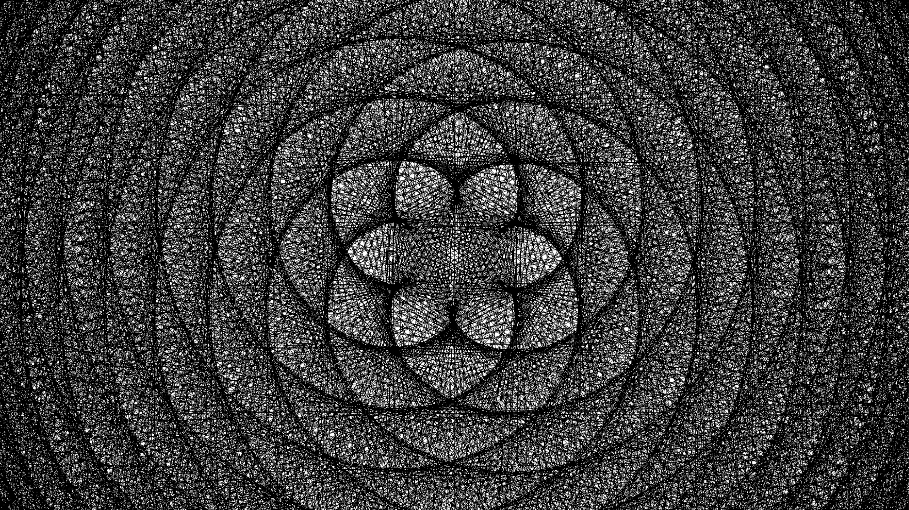
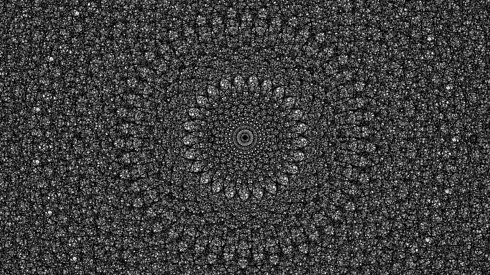
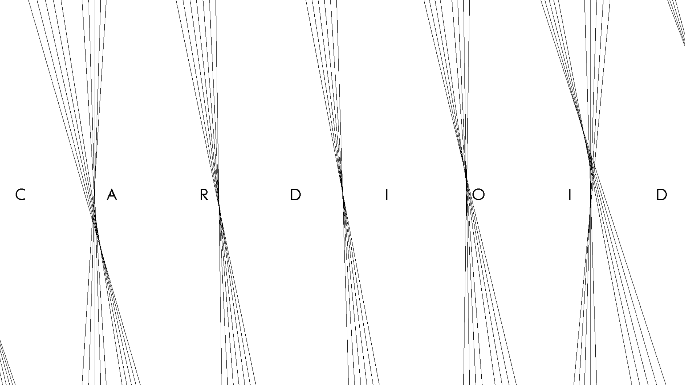
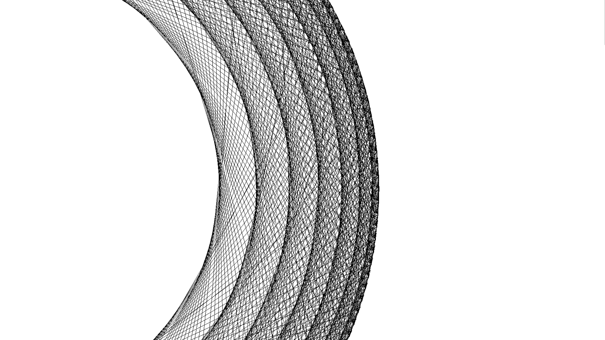
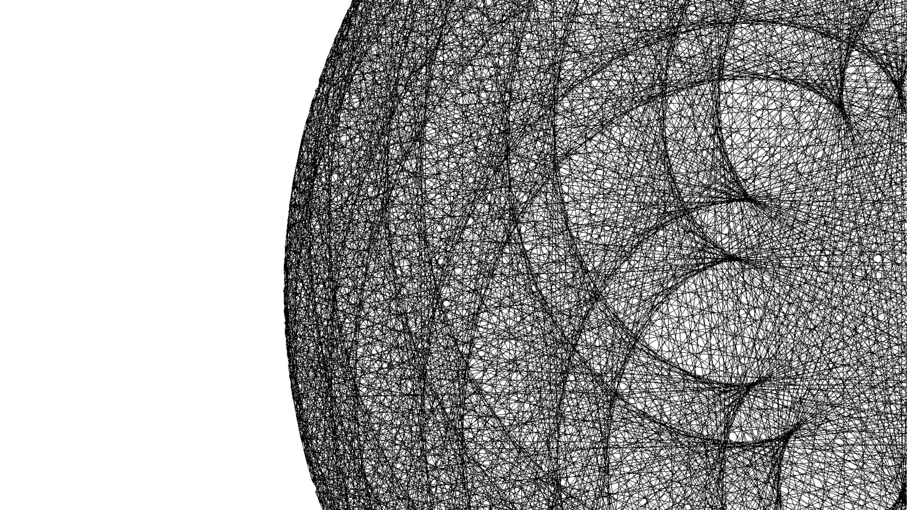
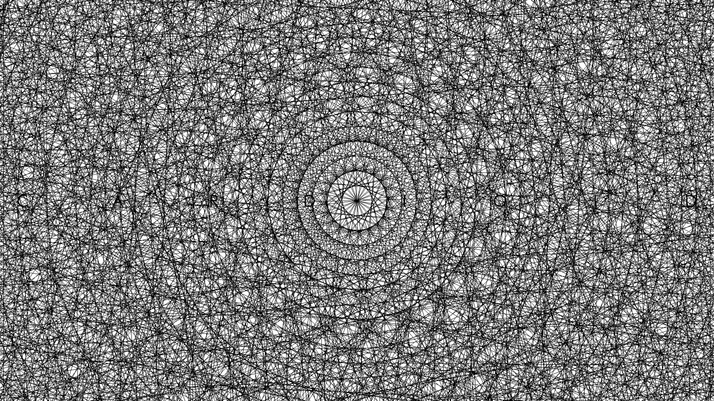
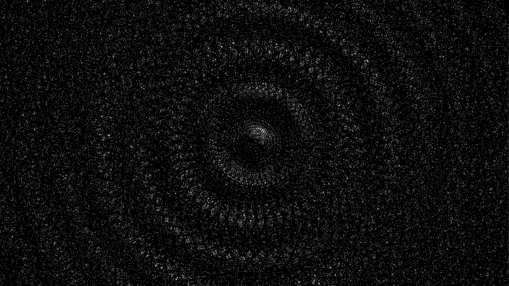

# Cardioid
A program to generate Cardioid, Nephroid and Other Epicycloids by using Easyx (a Graphics Library For C & cpp )

it was made by **Equation.** , a PBL group in *Hohai University* 

This is our first grade mid-term exam project  which uses connected lines to creat beautiful art shapes it will generate all epicycloids shape during its process, 

  
# Hope you enjoy it!

.png)

